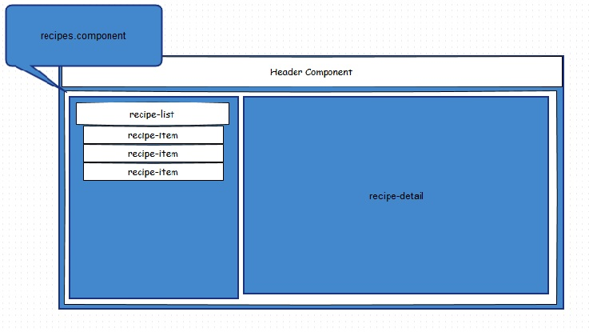

# Angular 2 

## creating course project


#### Recipe Book Component Layout




```
$ ng new recipe-book --prefix rb
```

but because I already have this project folder 

```
$ ng init --name recipe-book --prefix rb
```

The cli executes the following:

```
installing ng2
? Overwrite README.md? No, skip
? Overwrite .gitignore? No, skip
  create .editorconfig
  skip README.md
  create src/app/app-routing.module.ts
  create src/app/app.component.css
  create src/app/app.component.html
  create src/app/app.component.spec.ts
  create src/app/app.component.ts
  create src/app/app.module.ts
  create src/app/index.ts
  create src/app/shared/index.ts
  create src/assets/.gitkeep
  create src/assets/.npmignore
  create src/environments/environment.prod.ts
  create src/environments/environment.ts
  create src/favicon.ico
  create src/index.html
  create src/main.ts
  create src/polyfills.ts
  create src/styles.css
  create src/test.ts
  create src/tsconfig.json
  create src/typings.d.ts
  create angular-cli.json
  create e2e/app.e2e-spec.ts
  create e2e/app.po.ts
  create e2e/tsconfig.json
  skip .gitignore
  create karma.conf.js
  create package.json
  create protractor.conf.js
  create tslint.json
Installing packages for tooling via npm.

```

### create new 'header' component

```
$ cd src/app
$ ng g c header --flat
installing component
  create src/app/header.component.css
  create src/app/header.component.html
  create src/app/header.component.spec.ts
  create src/app/header.component.ts
```
remove header.component.css, as well as remove ```styleUrls: ['./header.component.css']```
from header.component.ts

### create new 'recipes' component

in src/app, run:
```
$ ng g c recipes 
  create src/app/recipes/recipes.component.css
  create src/app/recipes/recipes.component.html
  create src/app/recipes/recipes.component.spec.ts
  create src/app/recipes/recipes.component.ts
```

#### create `recipe-list` component inside `recipes` component

```
$ cd src/app/recipes
$ ng g c recipe-list
installing component
  create src/app/recipes/recipe-list/recipe-list.component.css
  create src/app/recipes/recipe-list/recipe-list.component.html
  create src/app/recipes/recipe-list/recipe-list.component.spec.ts
  create src/app/recipes/recipe-list/recipe-list.component.ts

```
#### create `recipe-item` component within `recipe-list` component

```
$ cd recipe-list
$ ng g c recipe-item --flat
installing component
  create src/app/recipes/recipe-list/recipe-item.component.css
  create src/app/recipes/recipe-list/recipe-item.component.html
  create src/app/recipes/recipe-list/recipe-item.component.spec.ts
  create src/app/recipes/recipe-list/recipe-item.component.ts
$ rm recipe-item.component.css
```
#### create `recipe` model class

```
$ cd src/app/recipes
$ ng g cl recipe
installing class
  create src/app/recipes/recipe.spec.ts
  create src/app/recipes/recipe.ts

```


## angular-cli

### Migrating to webpack-based cli

Some differences between pre-webpack and the webpack (beta16) versions:

* new components are now registered in app.module.ts in 'declarations':

```
@NgModule({
  declarations: [
    AppComponent
  ],
```  


Global package:

```
  $ sudo npm uninstall -g angular-cli
  $ npm cache clean
  $ npm install -g angular-cli@webpack

  $ ng -v

  Could not start watchman; falling back to NodeWatcher for file system events.
  Visit http://ember-cli.com/user-guide/#watchman for more info.
  angular-cli: 1.0.0-beta.11-webpack.8
  node: 6.4.0
  os: linux x64

```

### first-app

tried with the latest angular-cli@webpack.
all broken with typescript and other dependencies.
even updated to the latest node version.. still no luck.

went back to angular-cli@latest:

```
npm uninstall -g angular-cli
npm cache clean
npm install -g angular-cli@latest
```

that is still at ```angular-cli: 1.0.0-beta.10```

created new app

```$ ng new first-app```

Still at angular RC4:

```
{
  "name": "first-app",
  "version": "0.0.0",
  "license": "MIT",
  "angular-cli": {},
  "scripts": {
    "start": "ng serve",
    "postinstall": "typings install",
    "lint": "tslint \"src/**/*.ts\"",
    "test": "ng test",
    "pree2e": "webdriver-manager update",
    "e2e": "protractor"
  },
  "private": true,
  "dependencies": {
    "@angular/common": "2.0.0-rc.4",
    "@angular/compiler": "2.0.0-rc.4",
    "@angular/core": "2.0.0-rc.4",
    "@angular/forms": "0.2.0",
    "@angular/http": "2.0.0-rc.4",
    "@angular/platform-browser": "2.0.0-rc.4",
    "@angular/platform-browser-dynamic": "2.0.0-rc.4",
    "@angular/router": "3.0.0-beta.2",
    "es6-shim": "0.35.1",
    "reflect-metadata": "0.1.3",
    "rxjs": "5.0.0-beta.6",
    "systemjs": "0.19.26",
    "zone.js": "0.6.12"
  },
  "devDependencies": {
    "angular-cli": "1.0.0-beta.10",
    "codelyzer": "0.0.20",
    "ember-cli-inject-live-reload": "1.4.0",
    "jasmine-core": "2.4.1",
    "jasmine-spec-reporter": "2.5.0",
    "karma": "0.13.22",
    "karma-chrome-launcher": "0.2.3",
    "karma-jasmine": "0.3.8",
    "protractor": "3.3.0",
    "ts-node": "0.5.5",
    "tslint": "3.11.0",
    "typescript": "1.8.10",
    "typings": "1.3.1"
  }
}
```

Testing works:

```
$ ng serve
$ ng e2e
```

### Migrate to RC5 and introduce ngModule

create new component ```other```

```
$ ng g c other
installing component                                                                      
  create src/app/other/other.component.css                                                
  create src/app/other/other.component.html                                               
  create src/app/other/other.component.spec.ts                                            
  create src/app/other/other.component.ts                                                 
  create src/app/other/index.ts   
```

#### modify package.json for RC5

```
  "dependencies": {
    "@angular/common": "2.0.0-rc.5",
    "@angular/compiler": "2.0.0-rc.5",
    "@angular/core": "2.0.0-rc.5",
    "@angular/http": "2.0.0-rc.5",
    "@angular/platform-browser": "2.0.0-rc.5",
    "@angular/platform-browser-dynamic": "2.0.0-rc.5",
    "@angular/router": "3.0.0-rc.1",
    "@angular/forms": "0.3.0"
```

Verified that ```ng test``` and ```ng e2e``` did not break.


#### introduce a module

as of RC5, ngModule is still optional.

To create a module, create a new file ```app.module.ts```:

Create a new class ```AppModule``` that has an empty body, but is decorated
with NgModule decorator.
Prior to RC5, boostrapping of the main component occured in ```main.ts``` file.
With RC5, boostrapping moves to app.module.ts:

```
import { NgModule } from '@angular/core';
import { BrowserModule } from "@angular/platform-browser";
import { AppComponent } from "./app.component";

@NgModule({
  declarations: [AppComponent],
  imports: [BrowserModule],
  bootstrap: [AppComponent] 

})
export class AppModule {}
```

Now, in ```main.ts```.. Here is the old version:

```
import { bootstrap } from '@angular/platform-browser-dynamic';
import { enableProdMode } from '@angular/core';
import { AppComponent, environment } from './app/';

if (environment.production) {
  enableProdMode();
}

bootstrap(AppComponent);
```
..instead of boostrapping, we replace it with ```platformBrowserDynamic```.
we don't need to import the AppComponent anymore

```
import { platformBrowserDynamic } from '@angular/platform-browser-dynamic';
import { enableProdMode } from '@angular/core';
import { environment } from './app';
import { AppModule } from './app/app.module';

if (environment.production) {
  enableProdMode();
}

platformBrowserDynamic().bootstrapModule(AppModule);
```

And the app still works!


